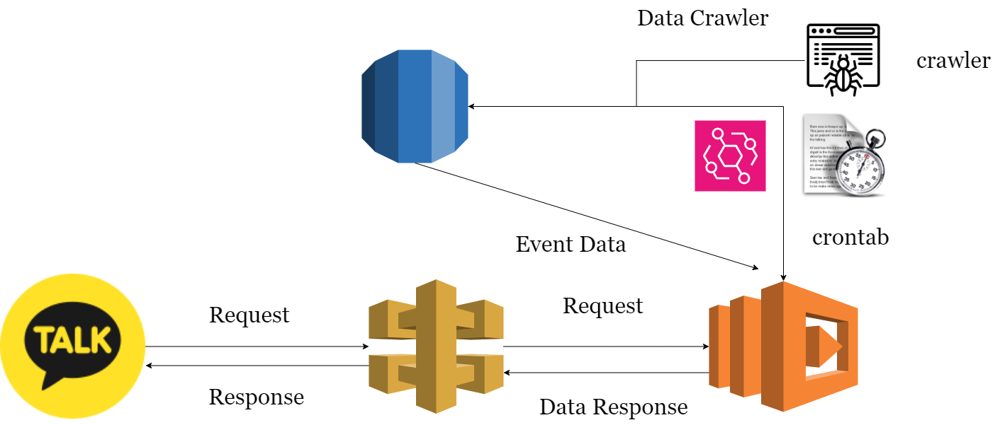
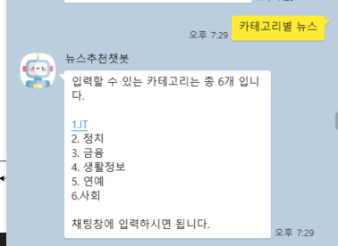
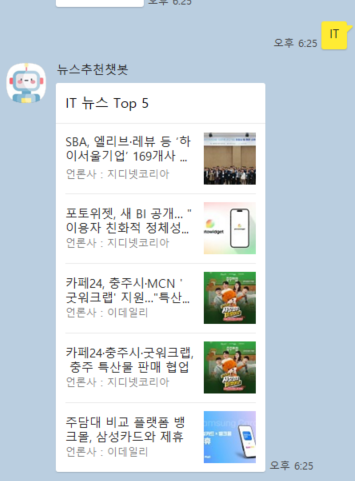
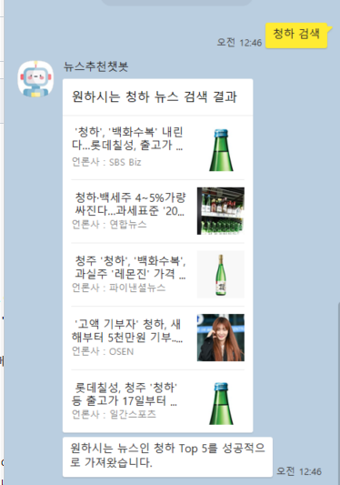

## 토이프로젝트 Kakao chatbot X AWS Lambda 

* 언어 : Python 
* 주요 기능 : AWS Serverless를 이용 하여 서버 없이도 이벤트성 함수로도 서비스를 구현 가능 
* 핵심 스택 : AWS Lambda, AWS Api Gateway, AWS RDS(MySQL)
----
# 시스템 아키텍처 



* 카카오톡 내에서 특정 요청이 들어 왔을 때, 그에 맞춰 데이터를 저장하고 수집하며 원하는 뉴스들을 수집하는 시스템 
* 주기적으로 뉴스 데이터를 AWS Event Bridge내 cron 스케줄링을 통해 데이터를 수집시키고 
* 특정 뉴스 카테고리에 맞게 데이터를 수집시키는 코드도 구현 
  ```python 
  def lambda_handler(event, context):
    
    korea_timezone = timezone(timedelta(hours=9))
    now_korea = datetime.now(korea_timezone)
    today_datetime = now_korea.strftime("%Y-%m-%d")
    
    url_point = [
        "https://news.daum.net/breakingnews/society/affair",
        "https://news.daum.net/breakingnews/politics/assembly",
        "https://news.daum.net/breakingnews/economic/finance",
        "https://news.daum.net/breakingnews/culture/life",
        "https://news.daum.net/breakingnews/entertain/topic",
        "https://news.daum.net/breakingnews/digital/internet"
    ]
    
    category = ["사회,사건사고", "국회,정당", "금융", "생활정보", "연예가화제", "IT"]
  ```

* 그렇기 때문에 카카오톡 챗봇에서 제공해줄 수 있는 카테고리 뉴스는 정해져 있기에 챗봇을 통해 고객에게 선택할 수 있는 카테고리를 명확하게 전달한 상태

### 챗봇 서비스 내용 
* 카테고리 선택 
  


* 카테고리별 뉴스 



* 특정 단어 검색 



----
## 아쉬운점 
* 고객 별 맞춤 추천 시스템을 구축하기 위한 제반이 부족했음(카테고리를 더 많이 수집하기 어려움), DB에 고객 별 id를 부여하여 테이블에 저장 시킨뒤 카테고리를 수집 하고 코사인 유사도를 기반으로 추천시스템을 구축하고 싶었으나 수집에 어려움이 많았음 (특히 크롤러가 작동이 되지 않는 경우가 많았음)
  
* AWS 시스템 과금으로 인해 더 많은 도전이 제한되었던게 컸던거 같다...